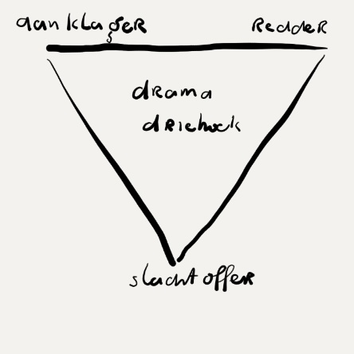

# reflection-models

This a work-in-progress collection of reflection models.

## Nederlands

<table>
    <tr>
        <td>
            
        </td>
        <td>
          
        </td>
        <td>
        
        </td>
    </tr>
    <tr>
      <td>80/20 regel</td>
      <td>roos van learey</td>
      <td>spiral dynamics</td>
    </tr>
    <tr>
      <td>basis communicatie</td>
      <td>kracht en macht</td>
      <td>wie je denkt dat je bent</td>
    </tr>
    <tr>
      <td>rollen</td>
      <td>waarden en acties</td>
      <td>edso</td>
    </tr>
    <tr>
      <td>absoluut/relatief</td>
      <td>hawkins</td>
      <td>expert beginner</td>
    </tr>
    <tr>
      <td>mindfullness wijsheden</td>
      <td>3 breinen</td>
      <td>expert beginner</td>
    </tr>
</table>

## English

<table>
    <tr>
        <td></td>
        <td></td>
        <td></td>
    </tr>
</table>
