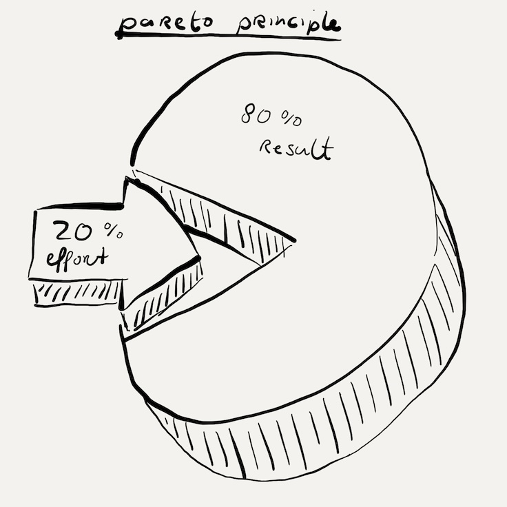

# 80/20 regel: Pareto Principle

### Pareto-principe: Overzicht en Toepassingen

Het Pareto-principe, ook bekend als de 80/20-regel, is een principe dat stelt dat 80% van de gevolgen voortkomt uit 20% van de oorzaken. Dit principe werd genoemd naar de Italiaanse econoom Vilfredo Pareto, die ontdekte dat 80% van het land in Italië in handen was van 20% van de bevolking. Dit fenomeen van ongelijkheid in distributie kan in veel verschillende contexten worden toegepast.

#### Kernideeën van het Pareto-principe

- **Ongelijke Verdeling**: Het principe wijst op een ongelijkheidsverdeling waar een klein percentage van de input een groot percentage van de output genereert.
- **Brede Toepasbaarheid**: Het principe kan worden toegepast in verschillende domeinen zoals economie, bedrijfskunde, kwaliteitsbeheer en persoonlijke tijdsbeheer.

#### Voorbeelden van het Pareto-principe

1. **Economie**: 80% van de rijkdom is in handen van 20% van de bevolking.
2. **Bedrijfsleven**: 80% van de omzet komt van 20% van de klanten.
3. **Kwaliteitsbeheer**: 80% van de problemen komt van 20% van de oorzaken.
4. **Tijdsbeheer**: 80% van de resultaten komt van 20% van de inspanningen.

### Toepassingen van het Pareto-principe

#### In het Bedrijfsleven

1. **Klantenbeheer**: Door te identificeren welke 20% van de klanten verantwoordelijk zijn voor 80% van de omzet, kunnen bedrijven hun marketing- en verkoopstrategieën beter richten.
2. **Productontwikkeling**: Bedrijven kunnen zich richten op de 20% van de producten die 80% van de winst genereren.
3. **Kwaliteitsverbetering**: Door de 20% van de oorzaken te identificeren die 80% van de defecten veroorzaken, kunnen bedrijven gerichte verbeteringen doorvoeren.

#### In Persoonlijk Tijdsbeheer

1. **Prioriteren van Taken**: Identificeer welke 20% van de taken verantwoordelijk zijn voor 80% van de resultaten en focus je energie daarop.
2. **Efficiëntie Verhogen**: Vermijd tijdverspillers en richt je op activiteiten die de meeste waarde opleveren.

### Voordelen van het Pareto-principe

- **Efficiëntieverbetering**: Door je te concentreren op de belangrijkste oorzaken, kun je tijd en middelen efficiënter inzetten.
- **Betere Besluitvorming**: Helpt bij het maken van strategische beslissingen door te focussen op wat het meeste impact heeft.
- **Probleemoplossing**: Vergemakkelijkt het identificeren van de grootste problemen, waardoor gerichte oplossingen kunnen worden geïmplementeerd.

### Kritiek en Beperkingen

Hoewel het Pareto-principe een nuttig hulpmiddel is, is het geen exacte wetenschap. Het geeft een richtlijn die in veel situaties nuttig kan zijn, maar het is belangrijk om de specifieke context in ogenschouw te nemen en flexibel te blijven.

#### Samenvatting

Het Pareto-principe, of de 80/20-regel, biedt een waardevol kader voor het begrijpen en optimaliseren van de verdeling van inspanningen en resultaten in diverse contexten. Door de belangrijkste oorzaken te identificeren die tot de meeste effecten leiden, kunnen zowel individuen als organisaties hun efficiëntie en effectiviteit aanzienlijk verbeteren.
